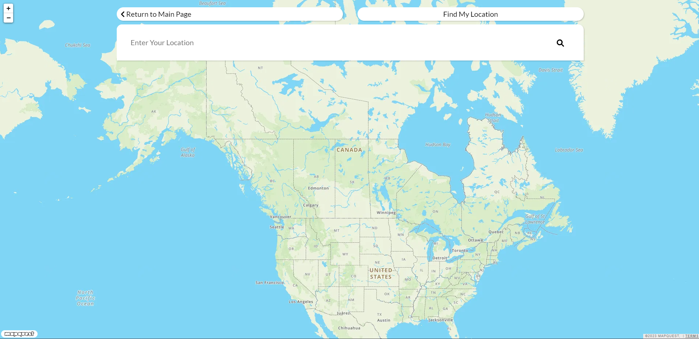
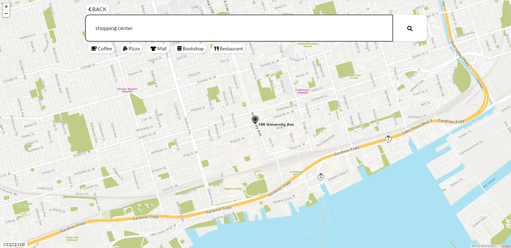
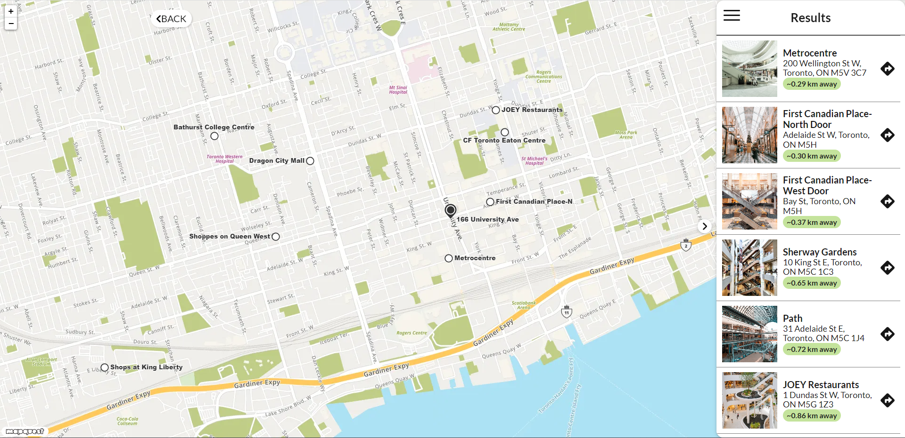
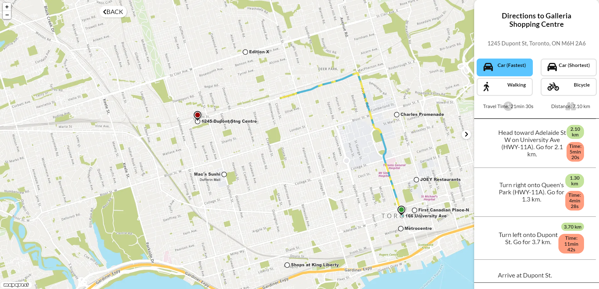

# Shopper Mapper 🗺️
Welcome to Shopper Mapper! The application allows users to search for locations, view points of interest, and get directions. Additionally, the application includes features such as custom map markers, pop-up information windows, and the ability to filter by category. 

## Play it here!
The application is deployed to netlify. View live site [here](https://shoppermapper.netlify.app/).

## Screenshots

Locate:

Search:

Results:

Direction:

## Technologies Used
- React (Router, useState, useEffect, props, components, pages)
- Data drawn from MapquestAPI, Geocoding API, Unsplash API. 
- JavaScript Library
- HTML
- CSS

